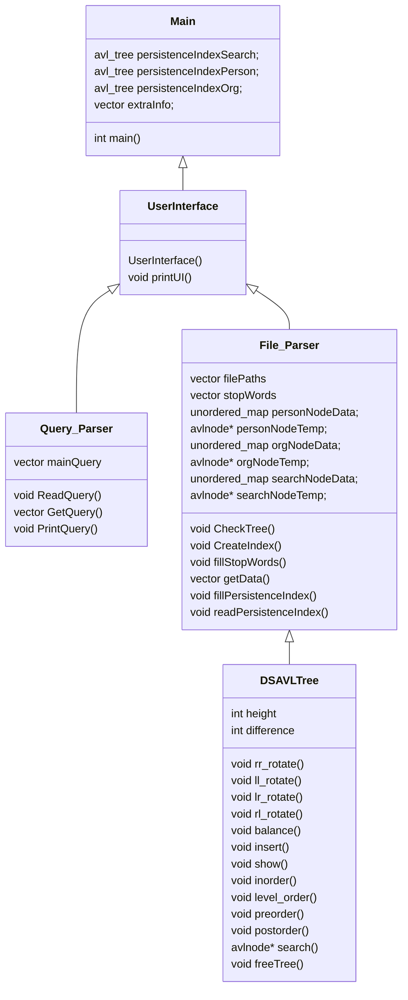

## High-level Design of Solution

- UML class diagram, etc

- High-level pseudo code for each component.
	- User Interface:
		- printUI() - Prints out the interface of the program, then takes in a number as an input. Then takes the input and directs you to the appropriate function, 1 for creating a new index from a directory, 2 for writing the index to a file, 3 for reading an index from a file, 4 for parsing a query, and 5 to exit the super search.
	- DSAVLTree:
		- height() - finds the height of a node in the tree
		- difference() - takes the height of both sides of the tree, finds the difference of the two, then returns the value
		- rr_rotate() - rotates the tree right twice, setting a new root
		- ll_rotate() - rotates the tree left twice, setting a new root
		- rl_rotate() - rotates the tree right then left, setting a new root
		- lr_rotate() - rotates the tree left then right, setting a new root
		- insert() - inserts a node, given the root node, the object that you wish to insert (in this case, an unordered_map<string, int>), and a string (in this case the name of the word to be inserted).
		- show() - prints out the name of every node, and shows you which node is the root node.
		- inorder() - outputs a string in an inorder style, unused by our implementation.
		- level_order() - outputs a string in a level order style, using a queue to store all nodes until they are used and popped, used by our implementation as it is the fastest way to read in an avl tree (no balancing required)
		- postorder() - outputs the avl tree in a post order style, unused by our implementation
		- preorder() - outputs the avl tree in a pre order style, unused by our implementation
		- search() - Takes in a node (tree root), and a string (name of a word) and searches all the nodes of the avl tree, using string comparisons to find the node with the name provided.
	- Query Parser: 
		- ReadQuery() - Reads in the query provided, stemming and checking if it is a stop word, then deciding if it is a person, organization, or word, then deciding if it is a not operation. Stores all of the data in a vector for the file parser to use for searching. 
		- GetQuery() - Getter, returns the current set of search terms.
		- PrintQuery() - Prints out the query, used for checking if our query was parsing correctly.
	- File Parser:
		- CheckTree() - checks the tree given the vector of parsed queries, then returns a ranked index of articles that contain the given words.
		- CreateIndex() - Creates an 3 AVLTree's (index) given a directory of json files, those being the People, Organization and Word AVLTree's, as well as creates an vector to store the entire text of each file and their publication date.
		- GetData() - Takes in the node that contains the word, iterates through it and populates a vector with all of the articles, ranking them from most frequent occurrence of a word to least. If there are already 15 articles, checks if the new article has a higher frequency than the lowest of the current articles, if it does, pop of the lowest article and push in the new one.
		- fillStopWords() - Fills the stop words from the text file, for filtering out the stop words from the files.
		- fillPersistenceIndex() - Fills the already stored AVL Tree into a file, creating a file that follows this format "<datatype`word~title|frequency\~title|frequency\~>" with datatype being either a person, organization, or word, the word being the name of the node, the title being the title of the article and frequency being the amount of times the word appears in said article.
		- readPersistenceIndex() - Reads in the data from the aforementioned file, storing all of the data into their 3 seperate trees.

## Your Timeline to Finish the Project
Weekly milestones/tasks. Set out a plan at the beginning and then record when you got it done.

| Task        | Planned completion | Actual completion | Time spent in hrs |
| ----------- | :-----------------:| :---------------: | :--------------------: |
| Create UML and Timeline           | Nov 5              | Nov 5             | 4               |:--------------------: |
| Create AVL Tree           | Nov 14              | Nov 16             | 10               ||:--------------------: |
| Create User-Interface and Query Processor         | Nov 17              | Nov 18             | 8               ||:--------------------: |
| Create Index Handler, Persistence, and Word Processor         | Nov 21              | Nov 23             | 15               ||:--------------------: |
| Implement file I/O for document input and setup relevancy rankings         | Nov 28              | Nov 27             | 13               |
| Finishing touches to code and documentation file completed.         | Dec 3              | Dec 4             | 9               |

## Used Data Structures
Explanation of what data structures are used where. For each, state 
    - time and space complexity (Big-Oh),
    - why it is the appropriate data structure and what other data structure could have been used.

AVL Tree - Used along the entire program. This structure was required for the program.
- Insertion and deletion time complexity is O(log n) 
- Search time complexity is O(n)

Vector - Used for stop words as well as all temporary storage when doing word comparisons. A vector was a good implementation for the temporary storing for comparison, but not for the stop words we chose to use it as it was the most familiar storage structure to us. A better option would have been to use an unordered map for the stop words, as it has a much faster time complexity.
- Time complexity of a vector is O(n), where n is the total number of elements stored in the vector.

Unordered Map - Used to store the documents that words occur in, as well as their frequency.
- Average time complexity is O(1) but worst case is O(n)'

## User Documentation 
- How to use the software.
	- Run the mainRun file, no command line arguments are required. It will return the following:
		-	Welcome to Super Search 
Select an Option Below 
   1 - Create an index from a directory with documents  
   2 - Write the index to a file 
   3 - Read an index from a file 
   4 - Enter a query 
   5 - Exit 
  - Select an option above, then follow the instructions from the program.
  - Option 1:
	  - Returns "Enter the path of the directory:"
	  - To use: Enter a directory of json files to be parsed.
  - Option 2:
	  - Returns "Enter the file path:"
	  - To use: Enter a file path where you would like to store the index.
  - Option 3:
	  - Returns "Enter the file path:"
	  - To use: Enter the path to the file containing a previously stored index.
  - Option 4: 
	  - Returns "Enter your search:"
	  - To use: Enter a search (for words, just type the word(s), for every person type "PERSON:\<name\>" (excluding quotes), for every organization type "ORG:\<name\>"(excluding quotes))
  - Option 5: 
	  - Exits the search engine   

- Some example queries with the results.
	- Example 1:
		- Select an Option Below 1 - Create an index from a directory with documents  2 - Write the index to a file 3 - Read an index from a file 4 - Enter a query 5 - Exit 1 Enter the path of the directory: ../sample_data/coll_1 Time elapsed: 0.0220043 seconds Index Created  Welcome to Super Search Select an Option Below 1 - Create an index from a directory with documents  2 - Write the index to a file 3 - Read an index from a file 4 - Enter a query 5 - Exit 2 Enter the file path: ../persistencetest.txt Time elapsed: 0.000611 seconds Persistence Index Written -- Welcome to Super Search 
Select an Option Below 1 - Create an index from a directory with documents  2 - Write the index to a file  3 - Read an index from a file  4 - Enter a query  5 - Exit 4 Enter your search: business ---- Results ---- 1 - German firms doing business in UK gloomy about Brexit - survey - 5 - Publish Date: 2018-02-27T20:09:00.000+02:00 Select a search: 1 (returns the text from the file matching the title selected) 

	- Example 2:
		- Welcome to Super Search 
Select an Option Below 
   1 - Create an index from a directory with documents  
   2 - Write the index to a file 
   3 - Read an index from a file 
   4 - Enter a query 
   5 - Exit 
3 
Enter the file path: ../persistencetest.txt 
Time elapsed: 0.0072077 seconds 
Persistence Index Read 
--  
Welcome to Super Search 
Select an Option Below 
   1 - Create an index from a directory with documents  
   2 - Write the index to a file 
   3 - Read an index from a file 
   4 - Enter a query 
   5 - Exit 
4 
Enter your search: business plan 
-- 
---- Results ---- 
1 - German firms doing business in UK gloomy about Brexit - survey - 7 - Publish Date: 2018-02-27T20:09:00.000+02:00 
Select a search: 1 
(returns the text from the file matching the title selected)

	- For searching for people: PERSON:\<name\>
	- For searching for organizations: ORG:\<name\>

## Performance
- Statistics for indexing all documents and timing.
	- Takes 103.761 seconds to index 1000 json files
	- Takes 3.061 seconds to write the avl trees created from the 1000 json files into a single persistence file
	- Takes 86.695 seconds to read back in those 1000 indexed json files
